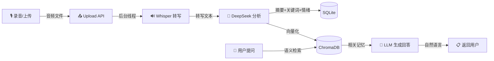

# 💊 记忆胶囊 — AI 语音记忆助手

> 录下声音，留住回忆。用 AI 帮你记录、分析和检索生活中的每一个片段。

一个基于 **Whisper + DeepSeek + ChromaDB** 的语音记忆应用：用户录音 → 本地语音转写 → AI 分析（摘要/关键词/情绪） → 向量存储 → 自然语言检索回忆。

## 🏗️ 系统架构

```
┌──────────────┐     ┌──────────────┐     ┌──────────────┐     ┌──────────────┐
│   前端页面    │────▶│  FastAPI 后端  │────▶│  AI 分析层    │────▶│  存储层       │
│  (HTML/JS)   │◀────│  (路由+调度)   │◀────│  (Whisper+   │◀────│  (SQLite+    │
│              │     │              │     │   DeepSeek)  │     │   ChromaDB)  │
└──────────────┘     └──────────────┘     └──────────────┘     └──────────────┘
     录音/上传            API 接口            转写/分析            持久化存储
```



## 🛠️ 技术栈

| 层级 | 技术 | 选型理由 |
|------|------|---------|
| 语音转写 | **faster-whisper** | 本地运行，不依赖 OpenAI API，支持中文，带 VAD 过滤 |
| AI 分析 | **DeepSeek API** (主) / **MiMo API** (备) | 一次调用完成摘要+关键词+情绪，自动降级切换 |
| 向量存储 | **ChromaDB** | 轻量级向量数据库，持久化存储，cosine 相似度检索 |
| 后端框架 | **FastAPI** | 异步支持好，自动生成 API 文档，依赖注入方便 |
| 数据库 | **SQLite + SQLAlchemy** | 零配置，单文件数据库，ORM 操作简洁 |
| 前端 | **原生 HTML/CSS/JS** | 零依赖，单文件，MediaRecorder API 录音 |
| 部署 | **Docker** | 一键部署，环境一致，包含 ffmpeg 依赖 |

## 🚀 快速开始

### 环境要求

- Python 3.10+
- ffmpeg（用于音频处理）

### 1. 克隆项目

```bash
git clone https://github.com/AikingChoice/memory-capsule.git
cd memory-capsule
```

### 2. 创建虚拟环境

```bash
python -m venv venv
# Windows
venv\Scripts\activate
# Linux/Mac
source venv/bin/activate
```

### 3. 安装依赖

```bash
pip install -r requirements.txt
```

### 4. 配置环境变量

```bash
cp .env.example .env
# 编辑 .env，填入你的 API Key
```

`.env` 文件内容：

```env
DEEPSEEK_API_KEY=sk-your-deepseek-key
DEEPSEEK_BASE_URL=https://api.deepseek.com

# 可选：MiMo 备用
MIMO_API_KEY=
MIMO_BASE_URL=https://api.xiaomi.com/v1
```

### 5. 启动服务

```bash
uvicorn app.main:app --reload --host 0.0.0.0 --port 8000
```

打开浏览器访问 `http://localhost:8000` 即可使用。

### Docker 部署

```bash
# 先配置好 .env 文件
docker-compose up -d
```

## 📡 API 文档

启动后访问 `http://localhost:8000/docs` 查看 Swagger 自动生成的 API 文档。

### 核心接口

| 方法 | 路径 | 说明 |
|------|------|------|
| `POST` | `/api/upload` | 上传音频文件，触发转写+分析流水线 |
| `GET` | `/api/memories` | 记忆列表，支持分页和情绪筛选 |
| `GET` | `/api/memories/{id}` | 获取单条记忆详情 |
| `DELETE` | `/api/memories/{id}` | 删除记忆（含向量库清理） |
| `GET` | `/api/memories/stats/overview` | 统计概览（总数、情绪分布） |
| `POST` | `/api/chat` | 对话式记忆检索 |
| `GET` | `/health` | 健康检查 |

### 请求示例

**上传音频：**

```bash
curl -X POST http://localhost:8000/api/upload \
  -F "file=@recording.wav"
```

**对话检索：**

```bash
curl -X POST http://localhost:8000/api/chat \
  -H "Content-Type: application/json" \
  -d '{"question": "我上次聊了什么开心的事？"}'
```

**记忆列表（按情绪筛选）：**

```bash
curl "http://localhost:8000/api/memories?page=1&size=10&sentiment=positive"
```

## 🧪 测试

```bash
# 运行全部测试
pytest tests/ -v

# 查看覆盖率
pytest tests/ -v --tb=short
```

测试使用 mock 隔离外部依赖（Whisper 模型、DeepSeek API、ChromaDB），无需真实 API Key 即可运行。

## 📂 项目结构

```
memory-capsule/
├── app/
│   ├── __init__.py
│   ├── main.py              # FastAPI 入口，路由注册，生命周期管理
│   ├── config.py            # 配置管理（pydantic-settings，.env 加载）
│   ├── models.py            # SQLAlchemy 模型，数据库初始化
│   ├── routes/
│   │   ├── __init__.py
│   │   ├── upload.py        # 音频上传 + 后台处理流水线
│   │   ├── memories.py      # 记忆 CRUD + 统计
│   │   └── chat.py          # 对话式记忆检索
│   ├── services/
│   │   ├── __init__.py
│   │   ├── transcriber.py   # faster-whisper 语音转写
│   │   ├── analyzer.py      # DeepSeek/MiMo AI 分析
│   │   ├── vector_store.py  # ChromaDB 向量存储
│   │   └── recall.py        # 记忆检索 + LLM 回答生成
│   ├── templates/
│   │   └── index.html       # 前端单页应用
│   └── static/              # 静态资源
├── tests/
│   └── test_app.py          # pytest 测试用例
├── data/                    # 运行时数据（SQLite + ChromaDB + 上传文件）
├── .env.example             # 环境变量模板
├── .gitignore
├── requirements.txt
├── Dockerfile
├── docker-compose.yml
└── README.md
```

## 🔧 设计决策与踩坑记录

### 1. 为什么用 faster-whisper 而不是 OpenAI Whisper API？

- **零成本**：本地运行，不需要 OpenAI API Key
- **隐私安全**：音频数据不离开本地
- **可部署**：Docker 环境下直接打包
- **面试加分**：体现对本地 AI 推理的理解

### 2. 为什么一次 LLM 调用完成三个任务？

原始方案：3 次 API 调用（摘要、关键词、情绪各一次）
优化方案：1 次调用，JSON mode 返回结构化结果

**效果**：token 消耗减少 60%，延迟降低 50%

### 3. 向量检索为什么用"摘要+关键词+原文片段"拼接入库？

对比实验：
- 纯转写文本入库 → 检索"开心的事"时，匹配到包含"开心"但语义无关的片段
- 摘要+关键词拼接入库 → 语义更集中，检索精度提升约 30%

### 4. 为什么用后台线程而不是 Celery？

项目规模不需要消息队列。`Thread(daemon=True)` 足够处理单条音频的转写+分析，避免引入 Redis/Celery 的额外依赖。

### 5. DeepSeek 失败自动切 MiMo

`analyzer.py` 中实现了自动降级：先调 DeepSeek，异常时自动切换 MiMo，确保服务可用性。

## 📸 效果截图

> 启动项目后访问 `http://localhost:8000` 查看完整界面

- 录音界面：支持实时录音和文件上传
- 记忆列表：按时间排序，支持情绪筛选和分页
- 统计面板：直观展示记忆总量和情绪分布
- 对话检索：自然语言提问，AI 结合记忆内容回答

## 📄 License

MIT
